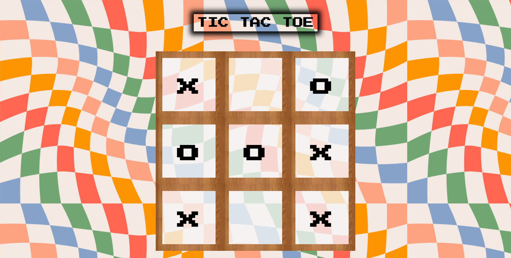

# Tic Tac Toe 🎮

Welcome to **Tic Tac Toe**, a fun and interactive game built using HTML, CSS, and JavaScript. Enjoy a classic game of Tic Tac Toe with a humorous twist: fun audio effects play when you win or the game ends in a draw!

## Table of Contents
- [Features](#features)
- [Getting Started](#getting-started)
- [Prerequisites](#prerequisites)
- [Installation](#installation)
- [Usage](#usage)
- [Screenshot](#screenshot)
- [Acknowledgements](#acknowledgements)

## Features ✨
- Classic Tic Tac Toe gameplay.
- Fun audio effects for win and draw scenarios.
- Simple and clean user interface.

## Getting Started 🚀

Follow these instructions to get a copy of the project up and running on your local machine.

### Prerequisites 📋
You need a web browser to run this game.

### Installation 💾

1. **Clone the repository:**
    ```sh
    git clone https://github.com/Ihtesham-Latif/tic-tac-toe.git
    ```
2. **Navigate to the project directory:**
    ```sh
    cd tic-tac-toe
    ```

## Screenshots 📸



## Usage 🎲

Open the `index.html` file in your web browser to start playing the game.

### Game Rules:
- The game is played on a grid that's 3 squares by 3 squares.
- Player 1 is "X" and Player 2 is "O". Players take turns putting their marks in empty squares.
- The first player to get 3 of their marks in a row (vertically, horizontally, or diagonally) is the winner.
- When all 9 squares are full, the game is over.

### Fun Audio Effects:
- A winning audio effect will play when a player wins.
- A draw audio effect will play when the game ends in a draw.

## Acknowledgements 🌟

- [Google Fonts](https://fonts.google.com/) for the "Press Start 2P" font.
- Inspiration from classic Tic Tac Toe games.

